# ER Diagram - Partner Collaboration Platform

## Overview

This document contains the Entity-Relationship diagram for the Partner Collaboration Platform database schema.

## ER Diagram (Mermaid)

```mermaid
erDiagram
    %% ===========================================
    %% Core Entities
    %% ===========================================

    users {
        uuid id PK
        varchar email UK
        varchar password_hash
        varchar first_name
        varchar last_name
        varchar display_name
        varchar department
        varchar position
        varchar phone
        text avatar_url
        boolean is_active
        timestamp last_login_at
        timestamp created_at
        timestamp updated_at
        timestamp deleted_at
    }

    organizations {
        uuid id PK
        varchar name
        varchar name_kana
        varchar short_name
        organization_type organization_type
        varchar corporate_number
        varchar postal_code
        text address
        varchar phone
        varchar fax
        text website_url
        varchar industry
        integer employee_count
        bigint annual_revenue
        integer fiscal_year_end
        text notes
        boolean is_active
        timestamp created_at
        timestamp updated_at
        timestamp deleted_at
    }

    persons {
        uuid id PK
        uuid organization_id FK
        varchar email
        varchar first_name
        varchar last_name
        varchar first_name_kana
        varchar last_name_kana
        varchar display_name
        varchar department
        varchar position
        varchar phone
        varchar mobile_phone
        text notes
        boolean is_active
        timestamp created_at
        timestamp updated_at
        timestamp deleted_at
    }

    %% ===========================================
    %% Template Entities
    %% ===========================================

    templates {
        uuid id PK
        varchar name
        text description
        project_type project_type
        boolean is_default
        boolean is_active
        integer version
        uuid created_by FK
        timestamp created_at
        timestamp updated_at
        timestamp deleted_at
    }

    template_phases {
        uuid id PK
        uuid template_id FK
        varchar name
        text description
        integer sort_order
        integer default_duration_days
        timestamp created_at
        timestamp updated_at
    }

    template_tasks {
        uuid id PK
        uuid template_phase_id FK
        varchar name
        text description
        integer sort_order
        integer default_duration_days
        boolean is_milestone
        jsonb reminder_config
        timestamp created_at
        timestamp updated_at
    }

    %% ===========================================
    %% Project Entities
    %% ===========================================

    projects {
        uuid id PK
        varchar name
        varchar code
        text description
        project_type project_type
        company_role company_role
        project_status status
        integer health_score
        date start_date
        date end_date
        date actual_end_date
        bigint budget
        bigint actual_cost
        uuid template_id FK
        uuid owner_user_id FK
        jsonb custom_fields
        varchar_array tags
        text notes
        timestamp created_at
        timestamp updated_at
        timestamp deleted_at
    }

    project_phases {
        uuid id PK
        uuid project_id FK
        uuid template_phase_id FK
        varchar name
        text description
        integer sort_order
        date planned_start_date
        date planned_end_date
        date actual_start_date
        date actual_end_date
        project_status status
        timestamp created_at
        timestamp updated_at
        timestamp deleted_at
    }

    project_stakeholders {
        uuid id PK
        uuid project_id FK
        uuid organization_id FK
        stakeholder_tier tier
        uuid parent_stakeholder_id FK
        varchar role_description
        bigint contract_amount
        boolean is_primary
        text notes
        timestamp created_at
        timestamp updated_at
        timestamp deleted_at
    }

    stakeholder_contacts {
        uuid id PK
        uuid project_stakeholder_id FK
        uuid person_id FK
        boolean is_primary
        varchar role
        timestamp created_at
        timestamp updated_at
    }

    %% ===========================================
    %% Task Entities
    %% ===========================================

    tasks {
        uuid id PK
        uuid project_id FK
        uuid project_phase_id FK
        uuid template_task_id FK
        uuid parent_task_id FK
        varchar name
        text description
        task_status status
        integer priority
        uuid assignee_id FK
        uuid assignee_stakeholder_id FK
        date due_date
        date planned_start_date
        date planned_end_date
        date actual_start_date
        date actual_end_date
        decimal estimated_hours
        decimal actual_hours
        boolean is_milestone
        integer sort_order
        jsonb reminder_config
        jsonb custom_fields
        timestamp created_at
        timestamp updated_at
        timestamp deleted_at
    }

    task_comments {
        uuid id PK
        uuid task_id FK
        uuid user_id FK
        uuid person_id FK
        text content
        boolean is_internal
        timestamp created_at
        timestamp updated_at
        timestamp deleted_at
    }

    %% ===========================================
    %% Reminder & Notification Entities
    %% ===========================================

    reminder_configs {
        uuid id PK
        varchar name
        text description
        reminder_trigger_type trigger_type
        integer trigger_value
        notification_channel_array channels
        text message_template
        boolean is_active
        uuid created_by FK
        timestamp created_at
        timestamp updated_at
        timestamp deleted_at
    }

    task_reminders {
        uuid id PK
        uuid task_id FK
        uuid reminder_config_id FK
        boolean is_enabled
        timestamp next_trigger_at
        timestamp last_triggered_at
        timestamp created_at
        timestamp updated_at
    }

    notification_logs {
        uuid id PK
        uuid task_id FK
        uuid project_id FK
        uuid reminder_config_id FK
        uuid recipient_user_id FK
        uuid recipient_person_id FK
        varchar recipient_email
        notification_channel channel
        notification_status status
        varchar subject
        text message
        text error_message
        timestamp sent_at
        timestamp delivered_at
        jsonb metadata
        timestamp created_at
    }

    %% ===========================================
    %% Supporting Entities
    %% ===========================================

    attachments {
        uuid id PK
        uuid task_id FK
        uuid project_id FK
        uuid task_comment_id FK
        varchar file_name
        text file_path
        bigint file_size
        varchar mime_type
        uuid uploaded_by FK
        timestamp created_at
        timestamp deleted_at
    }

    audit_logs {
        uuid id PK
        varchar table_name
        uuid record_id
        varchar action
        jsonb old_values
        jsonb new_values
        uuid changed_by FK
        timestamp changed_at
        inet ip_address
        text user_agent
    }

    %% ===========================================
    %% Relationships
    %% ===========================================

    %% User relationships
    users ||--o{ projects : "owns"
    users ||--o{ templates : "creates"
    users ||--o{ tasks : "assigned_to"
    users ||--o{ task_comments : "writes"
    users ||--o{ reminder_configs : "creates"
    users ||--o{ attachments : "uploads"
    users ||--o{ audit_logs : "changes"
    users ||--o{ notification_logs : "receives"

    %% Organization relationships
    organizations ||--o{ persons : "employs"
    organizations ||--o{ project_stakeholders : "participates_in"

    %% Person relationships
    persons ||--o{ stakeholder_contacts : "contacts_for"
    persons ||--o{ task_comments : "writes"
    persons ||--o{ notification_logs : "receives"

    %% Template relationships
    templates ||--o{ template_phases : "has"
    templates ||--o{ projects : "used_by"
    template_phases ||--o{ template_tasks : "contains"
    template_phases ||--o{ project_phases : "source_for"
    template_tasks ||--o{ tasks : "source_for"

    %% Project relationships
    projects ||--o{ project_phases : "has"
    projects ||--o{ project_stakeholders : "involves"
    projects ||--o{ tasks : "contains"
    projects ||--o{ notification_logs : "generates"
    projects ||--o{ attachments : "has"

    %% Project Phase relationships
    project_phases ||--o{ tasks : "contains"

    %% Project Stakeholder relationships
    project_stakeholders ||--o{ stakeholder_contacts : "has"
    project_stakeholders ||--o{ project_stakeholders : "parent_of"
    project_stakeholders ||--o{ tasks : "assigned_to"

    %% Task relationships
    tasks ||--o{ tasks : "parent_of"
    tasks ||--o{ task_comments : "has"
    tasks ||--o{ task_reminders : "has"
    tasks ||--o{ notification_logs : "triggers"
    tasks ||--o{ attachments : "has"

    %% Reminder relationships
    reminder_configs ||--o{ task_reminders : "applied_to"
    reminder_configs ||--o{ notification_logs : "generates"

    %% Attachment relationships
    task_comments ||--o{ attachments : "has"
```



## Entity Descriptions

### Core Entities

| Entity | Description |
|--------|-------------|
| **users** | Internal users of the platform (employees) |
| **organizations** | Partner companies and organizations |
| **persons** | Contact persons at partner organizations |

### Template Entities

| Entity | Description |
|--------|-------------|
| **templates** | Project templates for different project types |
| **template_phases** | Phase definitions within templates |
| **template_tasks** | Task definitions within template phases |

### Project Entities

| Entity | Description |
|--------|-------------|
| **projects** | Main project/case records |
| **project_phases** | Phases within a specific project |
| **project_stakeholders** | Organizations participating in a project (with tier hierarchy) |
| **stakeholder_contacts** | Contact persons for each stakeholder |

### Task Entities

| Entity | Description |
|--------|-------------|
| **tasks** | Individual tasks within projects |
| **task_comments** | Comments on tasks (supports internal/external visibility) |

### Reminder & Notification Entities

| Entity | Description |
|--------|-------------|
| **reminder_configs** | Configurable reminder rules |
| **task_reminders** | Reminders applied to specific tasks |
| **notification_logs** | History of sent notifications |

### Supporting Entities

| Entity | Description |
|--------|-------------|
| **attachments** | File attachments (polymorphic: task, project, or comment) |
| **audit_logs** | Change history for auditing |

## Key Relationships

### Project-Stakeholder Hierarchy

```
Project
  |
  +-- ProjectStakeholder (Tier1) -- Organization A
  |     |
  |     +-- StakeholderContact -- Person 1
  |     +-- StakeholderContact -- Person 2
  |     |
  |     +-- ProjectStakeholder (Tier2) -- Organization B (child)
  |           |
  |           +-- StakeholderContact -- Person 3
  |
  +-- ProjectStakeholder (Tier1) -- Organization C
```

### Task Assignment

Tasks can be assigned to:
1. **Internal users** (`assignee_id` -> `users`)
2. **External stakeholders** (`assignee_stakeholder_id` -> `project_stakeholders`)

### Reminder Flow

```
ReminderConfig (rule definition)
       |
       v
TaskReminder (applied to specific task)
       |
       v
NotificationLog (sent notification record)
```

## ENUM Types

### project_type
- `joint_development` - Joint development
- `sales_partnership` - Sales partnership
- `technology_license` - Technology license
- `reseller_agreement` - Reseller agreement
- `consulting` - Consulting
- `other` - Other

### company_role
- `prime` - Prime contractor
- `subcontractor` - Subcontractor
- `partner` - Equal partner
- `client` - Client

### project_status
- `draft` - Draft
- `planning` - Planning
- `in_progress` - In progress
- `on_hold` - On hold
- `completed` - Completed
- `cancelled` - Cancelled

### task_status
- `not_started` - Not started
- `in_progress` - In progress
- `waiting` - Waiting
- `completed` - Completed
- `cancelled` - Cancelled

### stakeholder_tier
- `tier1` - Direct partner (Tier 1)
- `tier2` - Tier 2
- `tier3` - Tier 3
- `tier4` - Tier 4 and beyond

### notification_channel
- `email` - Email
- `slack` - Slack
- `teams` - Microsoft Teams
- `webhook` - Webhook
- `in_app` - In-app notification

### notification_status
- `pending` - Pending
- `sent` - Sent
- `delivered` - Delivered
- `failed` - Failed
- `cancelled` - Cancelled

## Indexes Summary

All tables include indexes for:
- Primary keys (UUID)
- Foreign keys
- Commonly queried fields (status, dates, active flags)
- Soft delete support (`WHERE deleted_at IS NULL`)

Special indexes:
- GIN indexes on `projects.tags` and `projects.custom_fields` for JSONB queries
- Partial indexes for boolean flags to optimize common queries
